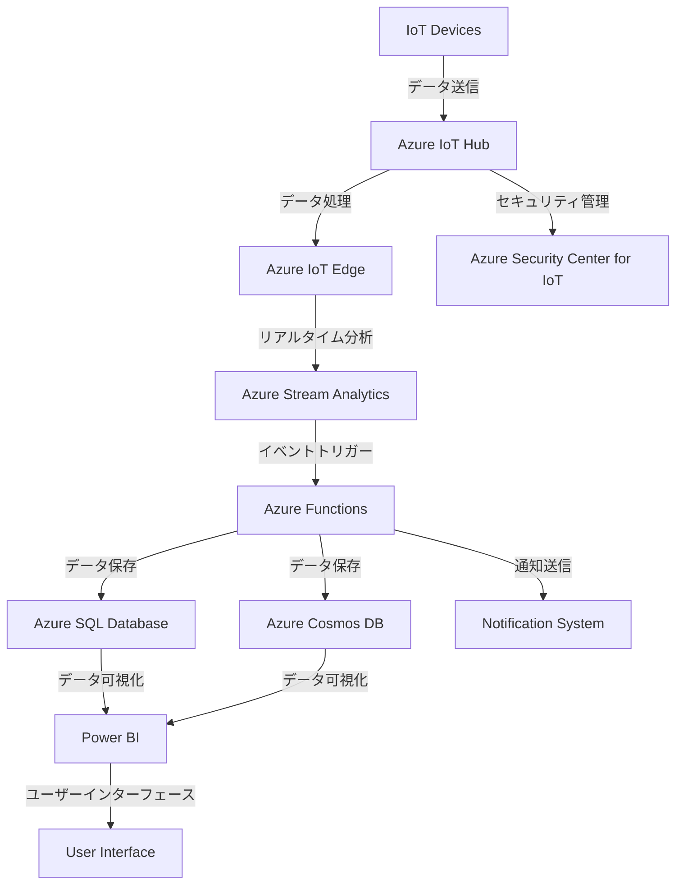

# システム全体アーキテクチャ図



## Azure Security Center for IoTの設定手順

1. **Azure CLIのインストール**: Azure CLIがインストールされていることを確認します。これは`.devcontainer/devcontainer.json`ファイルに記載されたコマンドを使用して行うことができます。
2. **Azureログイン**: `az login`コマンドを使用してAzureアカウントにログインします。
3. **リソースグループの作成**: IoTリソースを管理するリソースグループを作成します。
    ```bash
    az group create --name <リソースグループ名> --location <リージョン>
    ```
4. **IoTハブの作成**: IoTデバイスを管理するためのIoTハブを作成します。
    ```bash
    az iot hub create --resource-group <リソースグループ名> --name <IoTハブ名> --sku S1 --location <リージョン>
    ```
5. **Azure Security Center for IoTの有効化**: 作成したIoTハブでAzure Security Center for IoTを有効にします。
    ```bash
    az iot hub update --name <IoTハブ名> --set properties.enableDataResidency=true
    ```
6. **セキュリティ設定の構成**: IoTハブのセキュリティ設定を構成し、安全な通信とデータ保護を確保します。
    ```bash
    az iot hub update --name <IoTハブ名> --set properties.enableFileUploadNotifications=true
    ```
7. **セキュリティの監視と管理**: Azure Security Center for IoTを使用して、IoTデバイスとアプリケーションのセキュリティを監視および管理します。これには、脅威検出、セキュリティポスチャ管理、およびコンプライアンス監視が含まれます。

## 予知保全のためのAzure Machine Learningの統合

1. **データ収集**: IoTデバイスからの履歴データとリアルタイムデータを収集し、`Azure SQL Database`および`Azure Cosmos DB`に保存します。
2. **モデルのトレーニング**: 収集したデータを使用して、機械学習モデルをトレーニングし、設備の故障を予測します。
3. **モデルのデプロイ**: トレーニングされたモデルをAzure IoT Edgeにデプロイし、エッジでのリアルタイム推論と意思決定を行います。
4. **Azure Stream Analyticsとの統合**: Azure Stream Analyticsを使用して、リアルタイムデータストリームを処理し、モデルの予測に基づいて予知保全アクションをトリガーします。

## 通知システムの実装

1. **Azure Functions**: Azure Functionsを使用して、IoTデバイスからのデータを処理および分析します。イベントや異常が検出された場合、Azure Functionsがトリガーされて通知を送信します。
2. **Azure IoT Hub**: IoTハブは、IoTデバイスとの接続と通信を管理し、データを適切なサービスに送信します。
3. **Azure Stream Analytics**: このサービスは、IoTデバイスからのリアルタイムデータストリームを分析します。特定の条件やしきい値が満たされた場合、Azure Functionsをトリガーして通知を送信します。
4. **通知チャネル**: 通知は、メール、SMS、プッシュ通知などのさまざまなチャネルを通じて送信されます。これらのチャネルは、ユーザーの好みや要件に基づいて構成できます。
5. **ユーザーインターフェース**: ユーザーインターフェースには、ユーザーが通知設定を構成できるダッシュボードが含まれます。これには、受信したいアラートの種類や、優先する通知チャネルの設定が含まれます。

## サードパーティの分析およびAIサービスとの統合

1. **Azure Machine Learningとの統合**: Azure Machine Learningを利用して、設備データを分析し、予知保全モデルを構築およびデプロイします。
2. **サードパーティの分析プラットフォームとの統合**: Google AnalyticsやMixpanelなどのプラットフォームと統合し、ユーザーのインタラクションを追跡し、アプリケーションの使用状況に関するインサイトを収集します。
3. **AI駆動のインサイト**: IBM WatsonやGoogle AIなどのサードパーティのAIサービスを使用して、設備データを分析し、設備のパフォーマンスとメンテナンスの改善に役立つアクショナブルなインサイトを提供します。
