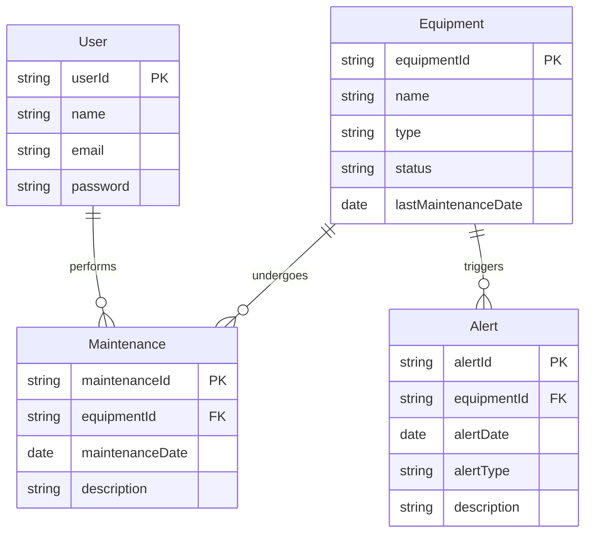

# データモデル

```mermaid
erDiagram
    User {
        string userId PK
        string name
        string email
        string password
    }
    Equipment {
        string equipmentId PK
        string name
        string type
        string status
        date lastMaintenanceDate
    }
    Maintenance {
        string maintenanceId PK
        string equipmentId FK
        date maintenanceDate
        string description
    }
    Alert {
        string alertId PK
        string equipmentId FK
        date alertDate
        string alertType
        string description
    }
    User ||--o{ Maintenance : "performs"
    Equipment ||--o{ Maintenance : "undergoes"
    Equipment ||--o{ Alert : "triggers"
```

