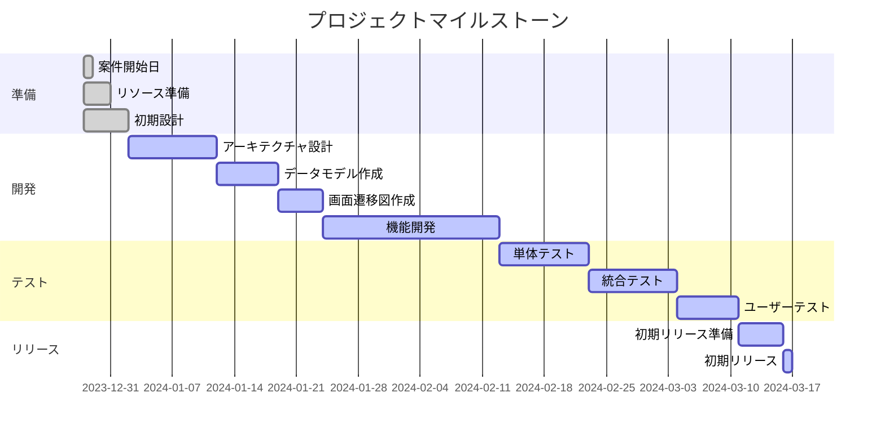

# プロジェクトのマイルストーン

## 計算の過程

### リソース状況
- 案件開始日：2023/12/28
- 初期リリースは3か月後
- 開発者の数は3名
- 平均稼働率：90%
- 土日・祝日は稼働しない

### 計算
1. **準備期間**: 2023/12/28 - 2024/01/01 (5日間)
2. **開発期間**: 2024/01/02 - 2024/02/12 (30日間)
3. **テスト期間**: 2024/02/13 - 2024/03/10 (20日間)
4. **リリース準備期間**: 2024/03/11 - 2024/03/15 (5日間)
5. **初期リリース日**: 2024/03/16

### 詳細なマイルストーン
- **準備**: 案件開始日、リソース準備、初期設計
- **開発**: アーキテクチャ設計、データモデル作成、画面遷移図作成、機能開発
- **テスト**: 単体テスト、統合テスト、ユーザーテスト
- **リリース**: 初期リリース準備、初期リリース
