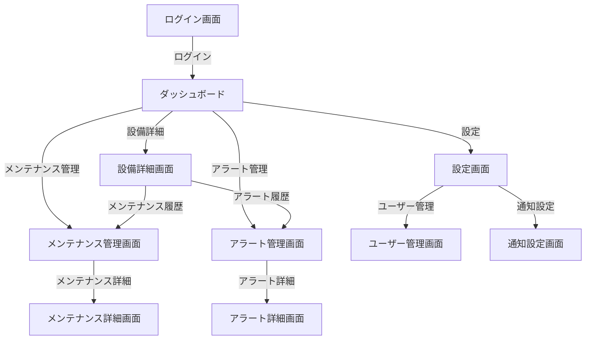

# 画面遷移図



## リアルタイムデータ可視化

リアルタイムデータの可視化には、Vue.jsとD3.jsを使用します。

### Vue.jsコンポーネント

以下は、リアルタイムデータを表示するためのVue.jsコンポーネントの例です。

```vue
<template>
  <div id="chart"></div>
</template>

<script>
import * as d3 from 'd3';

export default {
  name: 'RealTimeChart',
  data() {
    return {
      data: []
    };
  },
  mounted() {
    this.createChart();
    this.updateData();
  },
  methods: {
    createChart() {
      const svg = d3.select("#chart")
        .append("svg")
        .attr("width", 500)
        .attr("height", 300);

      svg.append("g")
        .attr("class", "x-axis")
        .attr("transform", "translate(0, 250)");

      svg.append("g")
        .attr("class", "y-axis")
        .attr("transform", "translate(50, 0)");
    },
    updateData() {
      // WebSocketを使用してリアルタイムデータを受信
      const socket = new WebSocket('ws://example.com/data');
      socket.onmessage = (event) => {
        const newData = JSON.parse(event.data);
        this.data.push(newData);
        this.updateChart();
      };
    },
    updateChart() {
      const svg = d3.select("svg");
      const x = d3.scaleTime().range([50, 450]);
      const y = d3.scaleLinear().range([250, 50]);

      x.domain(d3.extent(this.data, d => d.time));
      y.domain([0, d3.max(this.data, d => d.value)]);

      const xAxis = d3.axisBottom(x);
      const yAxis = d3.axisLeft(y);

      svg.select(".x-axis").call(xAxis);
      svg.select(".y-axis").call(yAxis);

      const line = d3.line()
        .x(d => x(d.time))
        .y(d => y(d.value));

      svg.selectAll(".line")
        .data([this.data])
        .join("path")
        .attr("class", "line")
        .attr("d", line);
    }
  }
};
</script>

<style>
.line {
  fill: none;
  stroke: steelblue;
  stroke-width: 2px;
}
</style>
```
